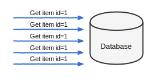

Writing an application that handles concurrent traffic from a lot of clients in
a performant way is not an easy task. To narrow this problem to web
applications only, serving as many HTTP requests as possible in a short time is
often a challenge.

In most cases of an HTTP application, optimizing access to the database can be
the easiest and the best first step.

## Caching database access

Using a database that provides plenty of functionality and storing data in
[denormalized form](https://en.wikipedia.org/wiki/Denormalization) makes
development easier. This comes at the cost of the database having to execute
complex queries and do more computation in order to return a result.

Making several database queries, even simple ones, to handle a request adds up
and makes our request handing slower. Even if a query is executed instantly,
the database client must transfer the data over the network each time.

Most databases implement some kind of internal caching. They optimize access to
popular data if the query complexity allows to do so. Why add an external cache
layer in front of the database then?

A cache layer can be added to remember:

1. the result of a **heavy query** that takes time and puts heavy load on the
   database.
2. the result of a **repeating query** that causes the database to waste
   resources on returning the same data all the time.


### The fastest code is the code that never runs

Imagine a very popular web application that displays the details of an _item_.
An _item_ is an entity identifiable by a unique number, that is rarely
changing. Due to heavy traffic, the database that stores _items_ is all the
time asked about the same entity.



To offload some of the repeating requests, we introduce a cache layer.
Whenever an item is needed, serve it from the cache. The database is queried
only if an item does not exist in the cache.


For the purpose of this post, let us assume we have a store and a cache
implementation available that implement the following interfaces. Delegating
[database access]() allows for a
cache implementation that is not tightly coupled to the original
implementation.


```go
type ItemStore interface {
	// FindItem item returns an item with given ID or ErrNotFound
	FindItem(ctx context.Context, itemID int64) (*Item, error)
}

type CacheStore interface {
	// Get loads value under given key into destValue. ErrMiss is returned
	// if key does not exist.
	Get(ctx context.Context, key string, destValue interface{}) error
	// Set value of given key.
	Set(ctx context.Context, key string, value interface{}, ttl time.Duration) error
}
```

Instead of directly calling the database each time an _item_ is needed, a cache
layer is used.


```go
func CacheItemStore(cache CacheStore, store ItemStore) ItemStore {
	return &cachedItemStore{
		store: store,
		cache: cache,
	}
}

type cachedItemStore struct {
	store ItemStore
	cache CacheStore
}

func (c *cachedItemStore) FindItem(ctx context.Context, itemID int64) (*Item, error) {
	cacheKey := fmt.Sprintf("item:%d", itemID)

	var item Item
	switch err := c.cache.Get(ctx, cacheKey, &item); err {
	case nil:
		return &item, nil
	case ErrMiss:
		// Not in cache, fetch from the database.
	default:
		// Cache error is not critical for providing this
		// functionality, log it and continue.
		log.Printf("cannot get from cache: %s", err)
	}

	item, err := c.store.FindItem(ctx, itemID)

	// To simplify this example, do not cache ErrNotFound. Depending on the use
	// case, remembering that an item does not exist might be desired.

	if err == nil {
		if err := c.cache.Set(ctx, cacheKey, &item, time.Minute); err != nil {
			// Cache error is not critical for providing this
			// functionality, log it and continue.
			log.Printf("cannot set in cache: %s", err)
		}
	}

	return item, err
}
```

Cache errors are not critical for the functionality of the `FindItem` method.
They are logged, so that we have a good insight into our application.

To decide for how long a result can be cached and when the value must be
refreshed, a domain knowledge is required.


## Cache stampede problem

Adding a cache layer can reduce the amount of calls to a resource that the
cache protects. Whether the resource is a database, an external service or a
local computation task, the amount of communication that happens can be
significantly reduced.

> There are two hard things in computer science: cache invalidation, naming
> things, and off-by-one errors.
>
> -- [Jeff Atwood](https://twitter.com/codinghorror/status/506010907021828096)

Most cache implementations store data with an expiration time, after which it
is removed. Using [time to live
(TTL)](https://en.wikipedia.org/wiki/Time_to_live) is an easy compromise to
ensure that stored data is never too old. Instead of trying to keep track of
when a certain query result is changing, remember the result for a short period
to minimize the possible errors.

Cache expiration introduces a new problem. Take our example of a web
application all the time displaying an item with ID 1. Hundreds of requests per
second and all of them require this item's details to be served.  When the item
with ID 1 is served from a cache, the database can allocate resources to do
something else.


Our cache is using TTL to ensure that served data is never too old. `FindItem`
will cache the result for one minute. After one minute, the value expires (it
is being removed from the cache) to force a refresh.

Keep in mind, that there are hundreds of requests happening every second. All
of them need the item with ID 1 to be served. The item is not in the cache
anymore, so the only place to get it is the database. This problem is called
[cache stampede](https://en.wikipedia.org/wiki/Cache_stampede).


The database is not being shielded by an external cache layer anymore. It also
does not have its own cache ready.

### Access Locking

To prevent the same query being executed multiple times when a value is not
cached, we can introduce a locking mechanism. Before asking the database,
acquire a "query lock".

Our lock will be implemented using a cache service. In addition to `Get` and
`Set` operations, `SetNx` is required.

```go
type CacheStore interface {
	Get(ctx context.Context, key string, destValue interface{}) error
	Set(ctx context.Context, key string, value interface{}, ttl time.Duration) error

	// SetNx sets the value of a given key only if it does not exist.
	// Returns ErrConflict if the key is already in use.
	SetNx(ctx context.Context, key string, value interface{}, ttl time.Duration) error
}
```

When `FindItem` is called, we first try to read the item from the cache. If the
item does not exist in the cache, we either acquire a lock and get data from
the database or keep checking the cache. A value will be cached by another
client or we will get the lock.


```go
func (c *cachedItemStore) FindItem(ctx context.Context, itemID int64) (*Item, error) {
	cacheKey := fmt.Sprintf("item:%d", itemID)

readFromCache:
	for {
		var item Item
		switch err := c.cache.Get(ctx, cacheKey, &item); err {
		case nil:
			return &item, nil
		case ErrMiss:
			// Not in cache, fetch from the database, but only of
			// no other client is already doing this.
			cacheKeyLock := cacheKey + ":query-lock"
			switch err := c.cache.SetNx(ctx, cacheKeyLock, 1, time.Second); err {
			case nil:
				// We own the lock, ask the database about the value.
				break readFromCache
			case ErrConflict:
				// Another process owns the lock. Wait until
				// the value is stored in the cache or the lock
				// is released and we can query the database.
				//
				// Short sleep ensures that we do not overuse
				// the cache.
				time.Sleep(25 * time.Millisecond)
				continue readFromCache
			default:
				log.Printf("cannot acquire lock in cache: %s", err)
				break readFromCache
			}
		default:
			// Cache error is not critical for providing this
			// functionality. Log it and continue.
			log.Printf("cannot get from cache: %s", err)
			break readFromCache
		}
	}

	item, err := c.store.FindItem(ctx, itemID)

	if err == nil {
		if err := c.cache.Set(ctx, cacheKey, &item, time.Minute); err != nil {
			log.Printf("cannot set in cache: %s", err)
		}
	}

	return item, err
}
```

Above implementation ensures that at most one client is asking the database
about an item with the same ID. If more than one `FindItem` call is done at the
same time, only one client will query the database while all others are waiting
for the cached result.

### Early expiration

The situation has improved for the database. But adding locking means that when
a value expires from the cache, all clients must wait until one of them fills
the cache. All clients waste time and server resources on waiting.


Our cache layer can be further improved by adding an early expiration
functionality. If an _item_ is cached for 1 minute, shortly before the
expiration time is due, tell one of the clients that the value must be updated.

```go
func (c *cachedItemStore) FindItem(ctx context.Context, itemID int64) (*Item, error) {
	cacheKey := fmt.Sprintf("item:%d", itemID)
	cacheKeyLock := cacheKey + ":query-lock"

readFromCache:
	for {
		var spItem stampedeProtectedItem
		switch err := c.cache.Get(ctx, cacheKey, &spItem); err {
		case nil:
			// If an early expiration time is due, acquire lock to
			// fetch item from the database.
			if spItem.refreshAt.Before(time.Now()) {
				if c.cache.SetNx(ctx, cacheKeyLock, 1, time.Second) == nil {
					break readFromCache
				}
				// If we did not get the lock, we can still
				// return the cached data. It will expire soon,
				// but it's still valid.
			}
			return &spItem.item, nil
		case ErrMiss:
			// Not in cache, fetch from the database, but only of
			// no other client is already doing this.
			switch err := c.cache.SetNx(ctx, cacheKeyLock, 1, time.Second); err {
			case nil:
				// We own the lock, ask the database about the value
				break readFromCache
			case ErrConflict:
				// Another process owns the lock. Wait until
				// the value is stored in the cache or the lock
				// is released and we can query the database.
				//
				// Short sleep ensures that we do not overuse
				// the cache.
				time.Sleep(25 * time.Millisecond)
				continue readFromCache
			default:
				log.Printf("cannot acquire lock in cache: %s", err)
				break readFromCache
			}
		default:
			log.Printf("cannot get from cache: %s", err)
			break readFromCache
		}
	}

	item, err := c.store.FindItem(ctx, itemID)

	if err == nil {
		spItem := stampedeProtectedItem{
			refreshAt: time.Now().Add(55 * time.Second),
			item:      item,
		}
		if err := c.cache.Set(ctx, cacheKey, &spItem, time.Minute); err != nil {
			log.Printf("cannot set in cache: %s", err)
		}
	}

	return item, err
}

type stampedeProtectedItem struct {
	refreshAt time.Time
	item      *Item
}
```

## Conclusion

Caching data that is often read can increase performance of an application.
Data caching is more complicated than it might look like at first sight.

Above cache stampede protection code example is tightly coupled to `ItemStore`.
If you are searching for a general use implementation, take a [look at
`surf.StampedeProtect`](https://github.com/go-surf/surf/blob/master/cache_stampede.go).

